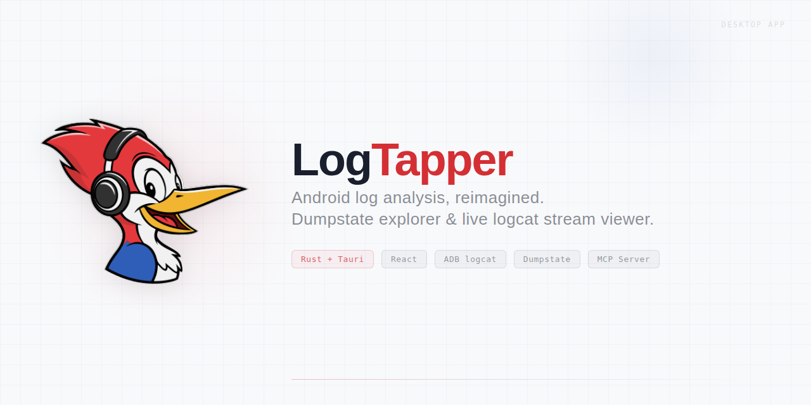

<picture>
  <source media="(prefers-color-scheme: dark)" srcset="assets/logtapper-social-banner.png">
  <source media="(prefers-color-scheme: light)" srcset="assets/logtapper-social-banner-light.png">
  
</picture>

# LogTapper

A desktop log analysis tool for Android developers. Load logcat, bugreport, dumpstate, and kernel (dmesg) files, or stream live from ADB — then search, filter, and run custom analysis pipelines powered by a YAML processor system with embedded Rhai scripting.

## Install

Download the latest release for your platform from [GitHub Releases](https://github.com/jpicklyk/logtapper/releases):

- **Windows:** `.exe` (NSIS installer) or `.msi`
- **macOS:** `.dmg` (note: you may need to right-click > Open on first launch — the app is not yet notarized)
- **Linux:** `.deb` or `.AppImage`

## Tech Stack

**Desktop shell:** [Tauri 2.x](https://v2.tauri.app/) — Rust backend + web frontend in a native window

**Backend (Rust)**
- Tauri command handlers for all IPC
- Custom log parsers (logcat, kernel, bugreport/dumpstate)
- Layered pipeline engine: transformers, reporters, state trackers, correlators
- Rhai scripting sandbox for processor logic
- PII anonymizer with pluggable detectors
- Axum HTTP bridge for MCP integration (`127.0.0.1:40404`)

**Frontend (React 18 / TypeScript)**
- [Vite 5](https://vite.dev/) for bundling and dev server
- [@tanstack/react-virtual](https://tanstack.com/virtual) for virtualized log viewing (handles millions of lines)
- [CodeMirror 6](https://codemirror.net/) for the editable scratch pad / text editor
- [Recharts](https://recharts.org/) for processor dashboard charts
- [@dnd-kit](https://dndkit.com/) for drag-and-drop tab management and processor chain ordering
- [lucide-react](https://lucide.dev/) icons, [clsx](https://github.com/lukeed/clsx) for class composition
- [mitt](https://github.com/developit/mitt) typed event bus for cross-hook coordination
- CSS Modules for scoped component styles
- Tauri dialog and window-state plugins

## Getting Started

### Prerequisites

- **Node.js** >= 18
- **Rust** (stable toolchain, MSVC on Windows)
- **npm** (comes with Node)

### Install dependencies

```bash
npm install
```

### Development

```bash
# Full app — starts Vite dev server + Rust backend together
npx tauri dev

# Frontend only (no Rust backend)
npx vite
```

### Build

```bash
# TypeScript check + Vite production bundle
npm run build

# Full Tauri app bundle (includes Rust compilation)
npx tauri build
```

### Tests

```bash
# Frontend tests
npm test

# Rust backend tests
cargo test --manifest-path src-tauri/Cargo.toml

# Rust linting
cargo clippy --manifest-path src-tauri/Cargo.toml -- -D warnings
```

## MCP Server

LogTapper includes an [MCP](https://modelcontextprotocol.io/) (Model Context Protocol) server that gives AI agents direct tool access to live log sessions. This lets tools like Claude Code query, search, and analyze logs loaded in the app without copy-pasting.

### How it works

1. The Tauri app runs a local HTTP bridge on `127.0.0.1:40404`
2. The MCP server (`mcp-server/`) connects via stdio transport (spawned by Claude Code or Claude Desktop)
3. The server translates MCP tool calls into HTTP requests to the bridge

### Capabilities

The server exposes 16 tools organized into these categories:

- **Session discovery** — list active sessions, get metadata (source type, line count, time range, tag distribution, bugreport sections)
- **Log querying** — sample lines (uniform/recent/around strategies), regex search with context, get lines around a point of interest
- **Pipeline & processors** — view processor definitions, trigger pipeline runs, get results (reporter emissions, state tracker transitions, correlator events)
- **State reconstruction** — get a tracker's state at any line number (e.g., "what was the WiFi state when this crash happened?")
- **Annotations** — manage bookmarks and analysis artifacts with line references
- **Live monitoring** — create watches with filter criteria for real-time ADB streaming

### Running the MCP server

```bash
cd mcp-server
npm install
npm start
```

Configure it in your Claude Code or Claude Desktop MCP settings to point at `mcp-server/src/index.ts` with the stdio transport.

## Project Structure

```
src-tauri/          Rust backend (Tauri commands, parsers, pipeline engine, MCP bridge)
src-next/           Frontend source (React components, hooks, cache layer)
mcp-server/         MCP server (Node.js, stdio transport)
marketplace/        Processor marketplace (YAML definitions + pack manifests)
docs/               Documentation
```

## Documentation

LogTapper uses a YAML-based processor system with embedded [Rhai](https://rhai.rs/) scripting for custom log analysis. See the **[Processor Authoring Guide](docs/processors/README.md)** to create your own analysis rules — reporters for extracting metrics, state trackers for monitoring transitions, and correlators for linking related events.

## License

Copyright (c) 2026 Jeff Picklyk

Licensed under the [GNU General Public License v3.0](LICENSE).
