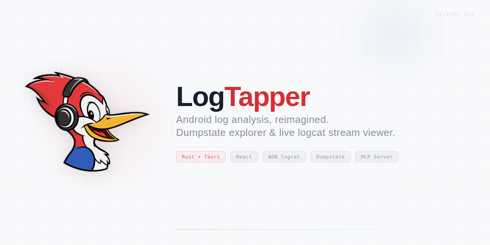

<picture>
  <source media="(prefers-color-scheme: dark)" srcset="assets/logtapper-social-banner.png">
  <source media="(prefers-color-scheme: light)" srcset="assets/logtapper-social-banner-light.png">
  
</picture>

# LogTapper

A desktop log analysis tool for Android developers, IT staff, and support personnel. Load logcat, bugreport, dumpstate, and kernel (dmesg) files, or stream live from ADB — then search, filter, and run custom analysis pipelines powered by a YAML processor system with embedded Rhai scripting.

## Install

Download the latest release for your platform from [GitHub Releases](https://github.com/jpicklyk/logtapper/releases):

- **Windows:** `.exe` (NSIS installer) or `.msi`
- **macOS:** `.dmg` — pick `aarch64` for Apple Silicon or `x64` for Intel (see the note below)
- **Linux:** `.deb` or `.AppImage`

### Updates

Installed builds update themselves. LogTapper checks for a newer release shortly after
launch and from **Settings > General > Updates**, where you can also check by hand;
"Install and restart" downloads the update, verifies its signature against the key built
into the app, installs it and relaunches. Neither the launch check nor the install opens a
browser, so the one-time steps below (SmartScreen on Windows, the quarantine flag on macOS)
do not repeat for updates. `.deb` installs are the exception and update by hand.

### macOS first launch

LogTapper is not yet notarized by Apple, so a downloaded build carries a quarantine
flag. On first launch macOS reports **"LogTapper is damaged and can't be opened"** and
offers to move it to the Trash. The app is not damaged — this is Gatekeeper blocking an
unsigned download. Right-clicking **Open** no longer clears it on current macOS.

To install:

1. Open the `.dmg` and drag **LogTapper** to your Applications folder.
2. Eject the disk image.
3. Remove the quarantine flag from the installed app:

   ```bash
   xattr -d -r com.apple.quarantine /Applications/LogTapper.app
   ```

4. Launch LogTapper from Applications as normal.

You only need to do this once per installed version. Removing notarization from the
warning path requires an Apple Developer Program membership; until then this step is the
supported install route on macOS.

## MCP Server

LogTapper ships a bundled MCP ([Model Context Protocol](https://modelcontextprotocol.io/))
server that gives AI agents direct tool access to your live log sessions — tools
for searching lines, running analysis pipelines, reading state-tracker events, and
managing bookmarks and watches. Installed releases need no Node.js or separate install.

Enable the bridge in **Settings > General > MCP Integration**, then connect your client:

| Client | Setup |
|---|---|
| **[Claude Code](docs/mcp/claude-code.md)** | One command with the URL shown in Settings (default `http://127.0.0.1:40405/mcp`) — or let the [LogTapper plugin](plugins/logtapper/README.md) do it |
| **[Claude Desktop](docs/mcp/claude-desktop.md)** | Install the bundled `.mcpb` relay once from Settings; it forwards to the same URL and never needs updating |
| **[Other MCP clients](docs/mcp/README.md#step-2--connect-your-client)** | Connect to the URL over Streamable HTTP, or launch the binary bundled with installed releases over stdio |

LogTapper must be running with the bridge enabled for tool calls to work.

See the **[MCP Setup Guide](docs/mcp/README.md)** for binary locations, the full
tool list, and troubleshooting.

### Claude Code plugin

The [LogTapper plugin](plugins/logtapper/README.md) adds two skills to Claude Code:
`attach-mcp`, which registers the MCP server for you and verifies it with a test
call, and `log-analysis`, which walks Claude through investigating the sessions you
have open — searching for crashes, tracing state transitions, running processors,
and publishing line-anchored findings back into the app.

Install it from the marketplace in this repo. Inside a Claude Code session:

```
/plugin marketplace add https://github.com/jpicklyk/logtapper
/plugin install logtapper@logtapper-plugins
```

Or from a terminal:

```bash
claude plugin marketplace add https://github.com/jpicklyk/logtapper
```

```bash
claude plugin install logtapper@logtapper-plugins
```

Then, with LogTapper running and the bridge enabled, ask Claude:

> attach to the LogTapper MCP

Full details in [Connect LogTapper to Claude Code](docs/mcp/claude-code.md).

## Documentation

LogTapper uses a YAML-based processor system with embedded [Rhai](https://rhai.rs/) scripting for custom log analysis. See the **[Processor Authoring Guide](docs/processors/README.md)** to create your own analysis rules — reporters for extracting metrics, state trackers for monitoring transitions, and correlators for linking related events.

## Contributing

Everything below is for building LogTapper from source. Users installing a release
need none of it.

### Tech Stack

**Desktop shell:** [Tauri 2.x](https://v2.tauri.app/) — Rust backend + web frontend in a native window

**Backend (Rust)**
- Tauri command handlers for all IPC
- Custom log parsers (logcat, kernel, bugreport/dumpstate)
- Layered pipeline engine: transformers, reporters, state trackers, correlators
- Rhai scripting sandbox for processor logic
- PII anonymizer with pluggable detectors
- Axum HTTP bridge (loopback only) behind the bundled MCP server

**Frontend (Solid 1.9 / TypeScript)**
- [Vite 8](https://vite.dev/) for bundling and dev server
- Hand-rolled virtualized viewer (`src-solid/viewer/`) over a shared fetch scheduler and line cache (handles millions of lines)
- [CodeMirror 6](https://codemirror.net/) for the editable scratch pad / text editor and analysis bodies
- Three-layer design tokens (`src-solid/styles/tokens.css`): dark, light and high-contrast bases, user themes on top
- Plain Solid stores composed once in `App.tsx`, CSS Modules for scoped component styles
- Tauri dialog and window-state plugins

### Prerequisites

- **Node.js** >= 22
- **Rust** (stable toolchain, MSVC on Windows)
- **npm** (comes with Node)
- **[Bun](https://bun.sh/)** (optional — only `npm run build:full` needs it, to compile the standalone MCP sidecar binary)

### Install dependencies

```bash
npm install
```

### Development

```bash
# Full app — starts Vite dev server + Rust backend together
npx tauri dev

# Frontend only (no Rust backend)
npm run dev
```

### Build

```bash
# TypeScript check + Vite production bundle
npm run build

# Full Tauri app bundle (includes Rust compilation)
npx tauri build
```

`npx tauri build` does not compile the MCP sidecar binary; the release workflow stages it
with Bun. A source checkout therefore has no sidecar, and `tauri dev` starts no MCP server —
see [Running from source](docs/mcp/README.md#running-from-source) to run it with Node instead.

### Tests

```bash
# Frontend tests
npm test

# Rust backend tests
cargo test --manifest-path src-tauri/Cargo.toml

# Rust linting
cargo clippy --manifest-path src-tauri/Cargo.toml -- -D warnings
```

### Releasing

Five files declare the version (`package.json`, `package-lock.json` twice,
`src-tauri/Cargo.toml`, `src-tauri/Cargo.lock`, `src-tauri/tauri.conf.json`); the updater
compares the installed app against what `tauri.conf.json` said at build time, so they must
never drift.

```bash
npm run version:bump -- 0.13.0      # writes all five
npm run version:check               # what release.yml also runs before building
git commit -am "chore(release): v0.13.0" && git tag v0.13.0 && git push --tags
```

The tag runs `.github/workflows/release.yml`: one job per platform, each uploading its
installers, the updater bundles and their `.sig` files to a **draft** release, and merging
its entry into the release's `latest.json`. Installed apps read
`releases/latest/download/latest.json`, which only ever resolves to a **published**
release — so check the draft has all four platform keys in `latest.json`, then publish.
Publishing is the moment every installed copy starts being offered the update.

**Signing key.** Updater bundles are minisign-signed. The public key is
`plugins.updater.pubkey` in `tauri.conf.json`; the private key exists only as the
`TAURI_SIGNING_PRIVATE_KEY` / `TAURI_SIGNING_PRIVATE_KEY_PASSWORD` repository secrets and
in the maintainer's password manager. It is compiled into every shipped build: if it is
lost, no existing install can ever accept another update and everyone reinstalls by hand.
It is never committed (`.gitignore` refuses `*.key`) and there is no rotation.

### Project Structure

```
src-tauri/          Rust backend (Tauri commands, parsers, pipeline engine, MCP bridge)
src-solid/          Frontend source (Solid UI: shell, viewer, stores, surfaces)
src-shared/         Framework-free modules shared with the frontend (IPC bindings, cache, filter, viewport)
mcp-server/         MCP server the app spawns over HTTP, plus the Claude Desktop relay (`.mcpb`)
marketplace/        Processor marketplace (YAML definitions + pack manifests)
plugins/            Claude Code plugin (attach-mcp and log-analysis skills) and its marketplace manifest
docs/               User documentation (MCP setup, processor authoring)
design_docs/        Architecture and security design specs
```

## License

Copyright (c) 2026 Jeff Picklyk

Licensed under the [GNU General Public License v3.0](LICENSE).
